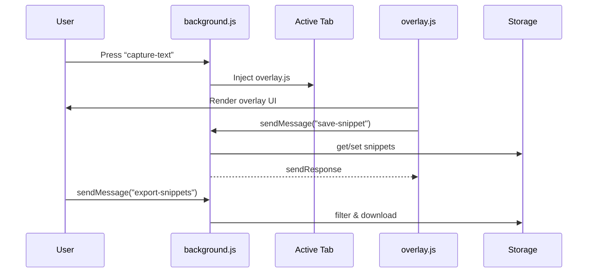
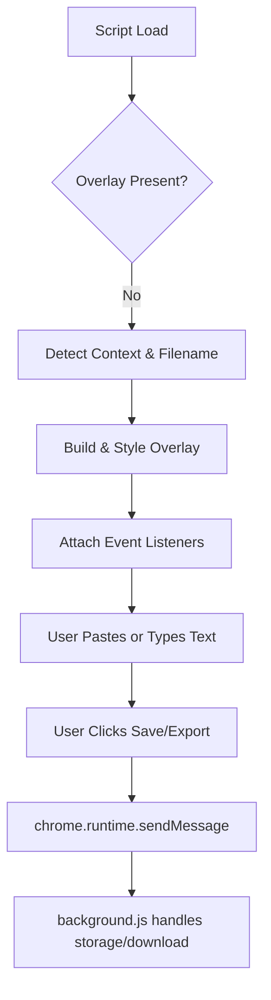

# .yaml  
This YAML file holds system instructions for the question-generation engine. It specifies input formats, global rules, processing steps, output schemas, and type-specific guidelines for the LLM.  

- Defines **SYSTEM** behavior and role  
- Details **INPUT format** (JSONL lines)  
- Outlines **GLOBAL RULES** and **PROCESS** steps (fact extraction → question generation)  
- Specifies **OUTPUT SCHEMA** and **TYPE-SPECIFIC RULES**  
- Provides an **EXAMPLE** and a final **NOW** trigger  

```yaml
# SYSTEM: You are a strict question generator. You will receive many input objects in JSONL...
# INPUT format (JSONL lines): each object may contain fields: id, raw_text, subject, grade, unit...
# PROCESS (must be followed in order)
#   STEP 1 — FACT EXTRACTION (internal)
#   STEP 2 — QUESTION GENERATION
# OUTPUT SCHEMA: single JSON array with question or skip objects
# TYPE-SPECIFIC RULES: mcq, fill, short, tf, match
# EXAMPLE: { "id":"s1", "raw_text":"Photosynthesis converts CO2 to oxygen.", ... }
# NOW: Process the JSONL input lines that follow. Return EXACTLY one JSON array.
```  

---

# background.js  
This service worker listens for the hotkey command, injects the overlay script into the active tab, and handles snippet storage and export via messaging.  

- **Hotkey Listener** (`capture-text`): intercepts `Ctrl+Shift+Y` and injects `overlay.js`  
- **Script Injection**: uses `chrome.scripting.executeScript` to load the overlay UI  
- **Message Handling** (`chrome.runtime.onMessage`):  
  - **save-snippet**: timestamps and appends payload to `chrome.storage.local`  
  - **export-snippets**: filters unexported snippets, triggers JSON download, marks them exported  
  - **clear-snippets**: resets the snippet list  

```js
chrome.commands.onCommand.addListener(async (command) => {
  if (command === "capture-text") {
    const [tab] = await chrome.tabs.query({ active: true, currentWindow: true });
    if (tab) {
      await chrome.scripting.executeScript({
        target: { tabId: tab.id },
        files: ["overlay.js"],
      });
    }
  }
});

// Handle save, export, clear actions
chrome.runtime.onMessage.addListener((msg, sender, sendResponse) => {
  if (msg.action === "save-snippet") {
    // ...append to storage and respond
    return true;
  }
  if (msg.action === "export-snippets") {
    // ...download JSON and update flags
    return true;
  }
  if (msg.action === "clear-snippets") {
    // ...clear storage
    return true;
  }
});
```  



---

# manifest.json  
This manifest defines extension metadata, permissions, commands, and the background service worker.  

| Field                     | Description                                                       |
|---------------------------|-------------------------------------------------------------------|
| **manifest_version**      | 3                                                                 |
| **name**                  | PDF Hotkey Extractor                                              |
| **version**               | 1.0                                                               |
| **description**           | Capture selected text with a hotkey, preview and save snippets.   |
| **permissions**           | storage, scripting, commands, downloads, activeTab                |
| **host_permissions**      | &lt;all_urls>                                                     |
| **background.service_worker** | background.js                                                |
| **commands.capture-text** | default: Ctrl+Shift+Y; opens overlay                             |
| **action.default_title**  | PDF Hotkey Extractor                                              |

```json
{
  "manifest_version": 3,
  "name": "PDF Hotkey Extractor",
  "version": "1.0",
  "description": "Capture selected text with a hotkey, preview and save snippets to questions.json (download).",
  "permissions": ["storage", "scripting", "commands", "downloads", "activeTab"],
  "host_permissions": ["<all_urls>"],
  "background": {
    "service_worker": "background.js"
  },
  "commands": {
    "capture-text": {
      "suggested_key": { "default": "Ctrl+Shift+Y" },
      "description": "Capture selected/copy text and open overlay"
    }
  },
  "action": {
    "default_title": "PDF Hotkey Extractor"
  }
}
```  

---

# overlay.js  
This script builds and manages the in-page overlay UI for capturing, annotating, and exporting snippets.  

- **Constants**  
  - `SUBJECTS`: supported subject list  
  - `UNITS`: page-range to unit mappings per grade/subject  
- **Context Detection**  
  - `detectContext()`: infers URL, title, and PDF page  
  - `detectSubjectAndGradeFromFilename()`: auto-detects subject/grade from file name  
  - `detectUnit()`: picks unit based on page number  
- **UI Construction**  
  - Creates a `<div id="clipboard-overlay">` with gradient styling  
  - Injects HTML: file name, page input, dropdowns, textarea, buttons  
- **Event Listeners**  
  - Input focus/blur and hover effects  
  - Change handlers to auto-detect units and enable save button  
  - Click handlers for **Save** (sends `save-snippet`), **Export** (sends `export-snippets`), **Close**  
  - `keydown` Escape to close  
- **Clipboard Handling**  
  - Attempts `navigator.clipboard.readText()`  
  - Falls back to `document.execCommand("paste")`  
- **Hashing & Payload**  
  - `computeHash()`: SHA-256 to dedupe snippets  
  - Builds snippet record with `id`, `raw_text`, `file_name`, `page`, `grade`, `unit`, `subject`, `url`, `timestamp`, `exported`  
- **Integration**  
  - Sends messages to `chrome.runtime` for saving/exporting  

```js
(async () => {
  const SUBJECTS = ["chemistry", "physics", "biology", "math"];
  const UNITS = {
    NINE: { biology: { 17: "Unit-1", 54: "Unit-2", /*...*/ } },
    TEN:  { chemistry: { 57: "Unit-1", /*...*/ } },
    // ELEVEN, TWELVE...
  };

  // Avoid duplicate overlay
  if (document.getElementById("clipboard-overlay")) return;

  // Create overlay element
  const overlay = document.createElement("div");
  overlay.id = "clipboard-overlay";
  Object.assign(overlay.style, {
    position: "fixed",
    top: "50%",
    left: "50%",
    transform: "translate(-50%, -50%)",
    background: "linear-gradient(135deg, #1e1b4b 0%, #312e81 100%)",
    border: "1px solid rgba(139,92,246,0.3)",
    borderRadius: "16px",
    boxShadow: "0 20px 60px rgba(0,0,0,0.5)",
    zIndex: 2147483647,
    padding: "20px",
    fontFamily: "Inter, sans-serif",
    color: "#f8fafc",
    maxWidth: "90vw",
    maxHeight: "85vh",
    overflowY: "auto"
  });

  // Inject HTML template and append
  overlay.innerHTML = `...`; 
  document.body.appendChild(overlay);

  // Attach event handlers, detect context, populate options...
  // Save and export logic using chrome.runtime.sendMessage
})();
```  

