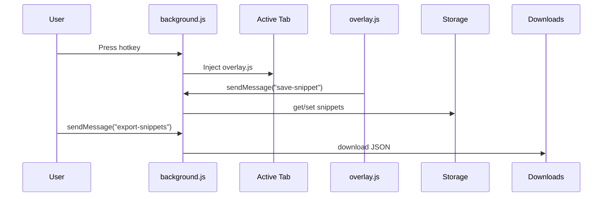

# .yaml  
This YAML file defines system instructions for the question-generation engine. It guides the LLM through input parsing, processing steps, and output formatting.  

- **SYSTEM**: Defines the LLM’s role and temperature (deterministic).  
- **INPUT**: Specifies JSONL fields (id, raw_text, subject, grade, unit, etc.).  
- **PROCESS**: Two internal steps—fact extraction then question generation.  
- **OUTPUT SCHEMA**: Single JSON array of question or skip objects.  
- **TYPE-SPECIFIC RULES**: mcq, fill, short, tf, match guidelines.  
- **EXAMPLE & NOW**: Illustrative example and trigger for real data.  

```yaml
SYSTEM: You are a strict question-generator. You will receive many input objects in **JSONL**.
---### INPUT format (JSONL lines)
Each line is a JSON object with fields:
  * id (string) — required
  * raw_text (string) — required
  * subject (string) — required
  * grade (string) — required (one of "NINE","TEN","ELEVEN","TWELVE")
  * unit (string) — required
  * optional: file_name, url, page, questionTypeRequest
---## PROCESS (must be followed in order)
**STEP 1** — FACT EXTRACTION (internal)  
**STEP 2** — QUESTION GENERATION  
---## OUTPUT SCHEMA
Return exactly one JSON array with question or skip objects.  
---## TYPE-SPECIFIC RULES
mcq, fill, short, tf, match guidelines apply.  
---## EXAMPLE & NOW
Example object shown; then `NOW: Process…` trigger.  
```  

---

# DOCUMENTAION.md  
This Markdown file provides high-level documentation for the extension’s core files. It outlines each file’s purpose and role in the overall workflow.  

- Summarizes **.yaml** (LLM instructions).  
- Details **background.js** (service worker logic).  
- Describes **manifest.json** (extension metadata).  
- Explains **overlay.js** (in-page capture UI).  
- Covers **view-snippets.js** (snippet management UI).  

```markdown
# .yaml  
This YAML file holds system instructions for the question-generation engine...
```  

---

# manifest.json  
This file declares the Chrome Extension’s metadata, permissions, commands, and assets.  

| Property                   | Description                                                          |
|----------------------------|----------------------------------------------------------------------|
| **manifest_version**       | 3                                                                    |
| **name**                   | PDF Hotkey Extractor                                                 |
| **version**                | 1.0                                                                  |
| **description**            | Capture selected text with a hotkey; preview and save snippets.      |
| **permissions**            | `storage`, `scripting`, `commands`, `downloads`, `activeTab`         |
| **host_permissions**       | `<all_urls>`                                                         |
| **background.service_worker** | `background.js`                                                  |
| **commands**               | `capture-text` (Ctrl+Shift+Y), `view-snippets` (Ctrl+Shift+Q)        |
| **action.default_title**   | PDF Hotkey Extractor                                                 |
| **web_accessible_resources** | Makes `.yaml` accessible to in-page scripts                        |

```json
{
  "manifest_version": 3,
  "name": "PDF Hotkey Extractor",
  "version": "1.0",
  "permissions": ["storage","scripting","commands","downloads","activeTab"],
  "host_permissions": ["<all_urls>"],
  "background": {"service_worker": "background.js"},
  "commands": {
    "capture-text": {"suggested_key": {"default": "Ctrl+Shift+Y"}},
    "view-snippets": {"suggested_key": {"default": "Ctrl+Shift+Q"}}
  },
  "action": {"default_title": "PDF Hotkey Extractor"},
  "web_accessible_resources": [{
    "resources": [".yaml"],
    "matches": ["<all_urls>"]
  }]
}
```  

---

# background.js  
The service worker handles hotkey commands and snippet data operations.  

- **Hotkey Listener**:  
  - `capture-text`: injects `overlay.js` into the active tab.  
  - `view-snippets`: injects `view-snippets.js` into the active tab.  
- **Script Injection**: Uses `chrome.scripting.executeScript`.  
- **Message Handling** (`chrome.runtime.onMessage`):  
  - `save-snippet`: appends a snippet to `chrome.storage.local`.  
  - `export-snippets`: filters unexported snippets, triggers JSON download, updates flags.  
  - `clear-snippets`: clears all stored snippets.  
  - `update-snippet` / `delete-snippet` / `view-snippets`: manage snippet lifecycle.  

```js
chrome.commands.onCommand.addListener(async (command) => {
  if (command === "capture-text") {
    const [tab] = await chrome.tabs.query({active: true, currentWindow: true});
    if (tab) {
      await chrome.scripting.executeScript({target:{tabId: tab.id}, files:["overlay.js"]});
    }
  }
  if (command === "view-snippets") {
    const [tab] = await chrome.tabs.query({active: true, currentWindow: true});
    if (tab) {
      await chrome.scripting.executeScript({target:{tabId: tab.id}, files:["view-snippets.js"]});
    }
  }
});

// Handle save, export, clear, update, delete, view actions...
chrome.runtime.onMessage.addListener((msg, sender, sendResponse) => {
  // ...
});
```



---

# overlay.js  
This in-page script renders a capture overlay and manages snippet creation.  

- **Constants**:  
  - `SUBJECTS`: Supported subjects.  
  - `UNITS`: Page-to-unit mappings per grade/subject.  
- **Context Detection**:  
  - `detectContext()`: Infers URL, title, PDF page.  
  - `detectSubjectAndGradeFromFilename()`: Guesses subject/grade from filename.  
  - `detectUnit()`: Chooses unit based on page.  
- **UI Construction**:  
  - Creates `<div id="clipboard-overlay">` with gradient styling.  
  - Injects form fields: file name, page, dropdowns, textarea, buttons.  
- **Event Listeners**:  
  - Focus, hover effects.  
  - Auto-detect unit/subject on input.  
  - **Save**: builds a snippet record, hashes it, sends `save-snippet`.  
  - **Export**: sends `export-snippets`.  
  - **Copy Prompt**: fetches `.yaml`, copies its content to clipboard.  
  - **Close / Escape**: removes the overlay.  
- **Clipboard Handling**:  
  - Tries `navigator.clipboard.readText()`; falls back to paste command.  
- **Hashing**:  
  - `computeHash()`: SHA-256 deduplication.  

```js
(async () => {
  const SUBJECTS = ["chemistry","physics","biology","math"];
  const UNITS = { /* grade→subject→page→unit map */ };
  if (document.getElementById("clipboard-overlay")) return;

  // Build and style overlay...
  const overlay = document.createElement("div");
  overlay.id = "clipboard-overlay";
  Object.assign(overlay.style, {
    position: "fixed", top: "50%", left: "50%",
    transform: "translate(-50%, -50%)",
    background: "linear-gradient(135deg,#1e1b4b,#312e81)",
    borderRadius: "16px", padding: "20px",
    zIndex: 2147483647, overflowY: "auto"
  });
  overlay.innerHTML = `...HTML template...`;
  document.body.appendChild(overlay);

  // Event handlers for save-export-copy-close...
})();
```

---

# view-snippets.js  
This script injects a management UI to view, filter, edit, and delete saved snippets.  

- **Overlay Setup**:  
  - Removes any existing overlay, then creates `#snippets-overlay`.  
  - Injects header, filters (subject, grade, page, exported), pagination buttons.  
- **Data Fetching**:  
  - Sends `view-snippets` message with filters & page.  
  - Renders a table of snippets with “view” buttons.  
- **Detail & Edit**:  
  - `showSnippetDetail()`: displays full snippet data.  
  - Modal form to edit grade, subject, unit, page, text, then sends `update-snippet`.  
- **Delete**:  
  - Confirms then sends `delete-snippet`.  
- **Pagination & Filtering**:  
  - Handles prev/next page, apply/clear filters.  
- **Clear All**:  
  - Sends `clear-snippets` to reset storage.  

```js
(() => {
  if (document.getElementById("snippets-overlay")) {
    document.getElementById("snippets-overlay").remove();
  }
  const overlay = document.createElement("div");
  overlay.id = "snippets-overlay";
  overlay.innerHTML = `
    <div class="overlay-content">
      <div class="overlay-header">
        <h2>✨ Snippets Viewer</h2>
        <button id="close-overlay">✕</button>
      </div>
      <div class="filters">
        <select id="filter-subject">…</select>
        <select id="filter-grade">…</select>
        <input id="filter-page" type="number" min="1"/>
        <select id="filter-exported">…</select>
        <button id="apply-filters">Apply</button>
        <button id="clear-filters">Clear</button>
      </div>
      <table>
        <thead>…</thead>
        <tbody id="snippets-body"></tbody>
      </table>
      <div class="pagination">
        <button id="prev-page">Prev</button>
        <span id="page-info"></span>
        <button id="next-page">Next</button>
      </div>
      <button id="delete-all">Clear All</button>
    </div>`;
  document.body.appendChild(overlay);

  // Fetch & render snippets, wire up event handlers...
})();
```

---

## File Relationships  
- **manifest.json** loads **background.js** as its service worker.  
- **background.js** injects **overlay.js** on “capture-text” and **view-snippets.js** on “view-snippets.”  
- **overlay.js** and **view-snippets.js** communicate with **background.js** via `chrome.runtime.sendMessage`.  
- **.yaml** is listed as a web-accessible resource; **overlay.js** can fetch and copy it.  
- **DOCUMENTAION.md** documents the above files and how they interconnect.